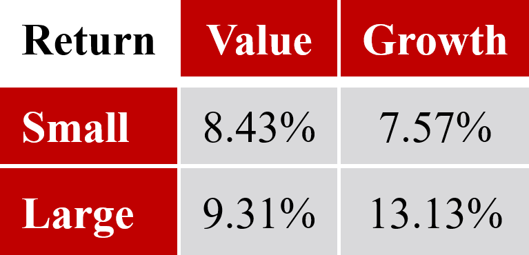
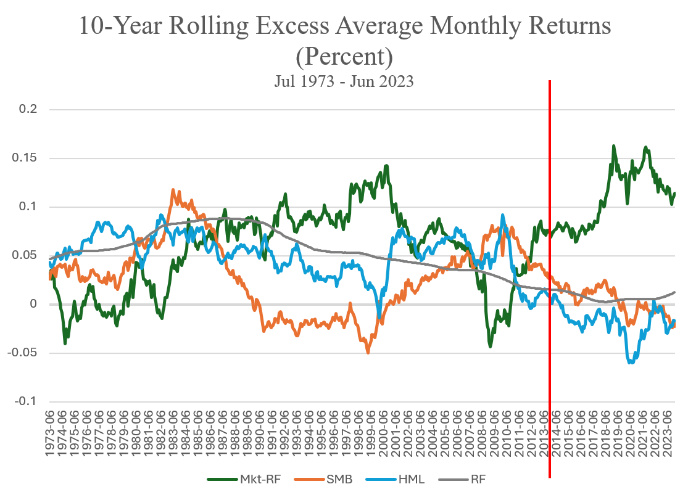
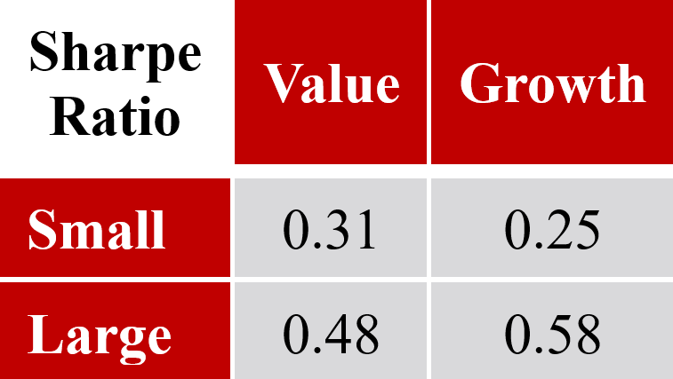
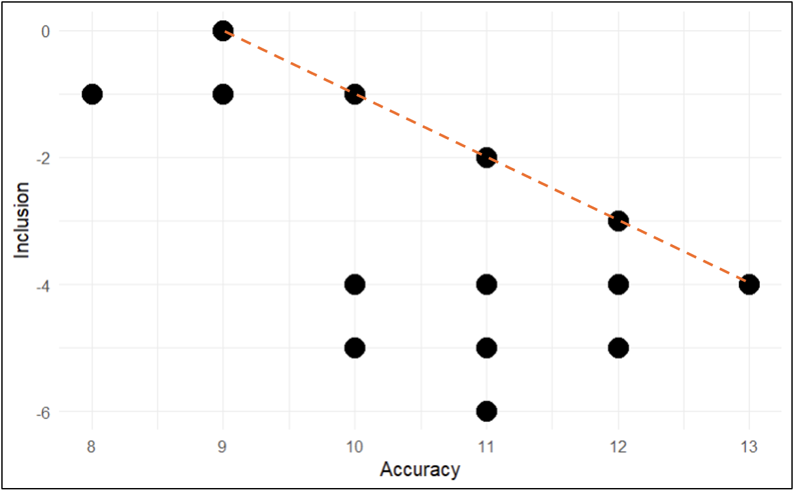
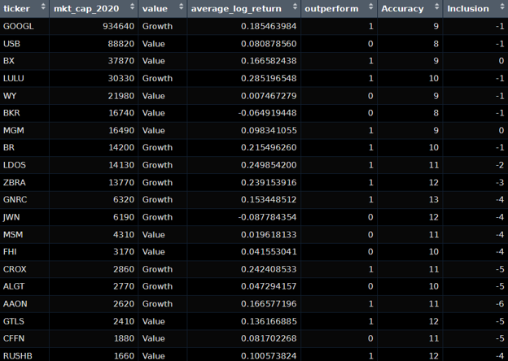
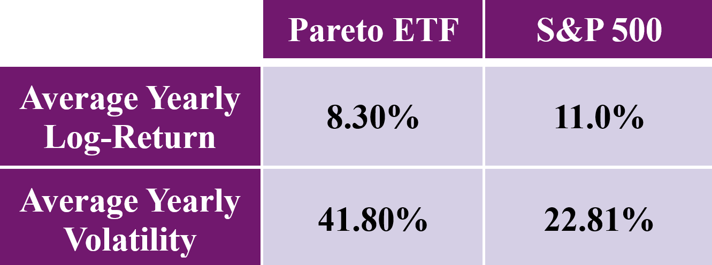
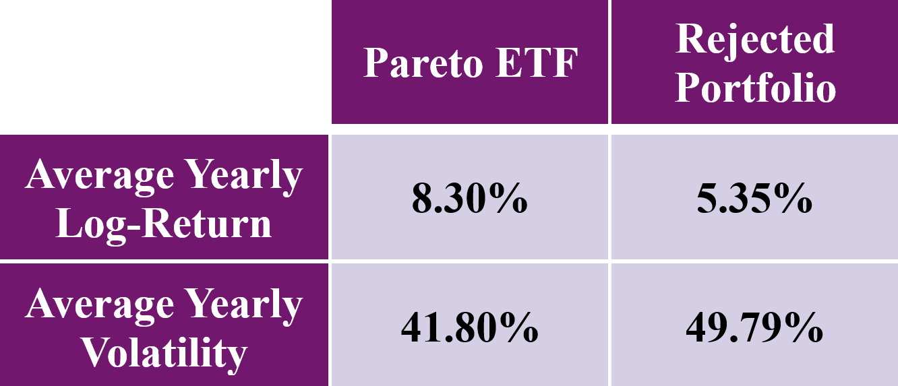

# Factor-Based Pareto Frontier Investing and Exchange Traded Funds
### A research project analyzing Exchange Traded Funds through Fama and French's five-factor asset pricing model and a Pareto frontier stock-selection approach.

## Overview
This project looks to analyze Exchange Traded Funds (ETFs) through the lens of Fama and French's five-factor asset pricing model.

The analysis first defines ETFs and describes the unique characteristics that appeal to investors, then covers the history of asset pricing models culminating in the five-factor asset pricing model proposed by Fama and French.

Using the knowledge of the five factors, this project identifies factor-exposed ETFs and tests their recent historical performance against the S&P 500. Finally, it proposes a novel way to view and assess stocks using the background of the five factors in the form of a Pareto frontier analysis, in hopes of discovering a way to empirically form diversified portfolios or ETFs.

## Research Question
Can factor-exposed ETFs and Pareto frontier analysis provide a useful way to identify and select stocks for the formation of diversified portfolios or ETFs?

## Key Results
- The VBR small-cap value ETF had the second lowest average yearly log-return over the past ten years, while VUG large-cap growth returned by far the highest.

<p align="center">
  
</p>

- Given the previous findings of Fama and French, we would expect small-cap value stocks to have the highest return and large-cap growth stocks to have the lowest return. The recent overperformance of the market risk factor, combined with recent negative excess returns for the size and value risk factors, helps explain the Vanguard ETF results.

  

- The S&P 500 average yearly Sharpe ratio was right on par with VUG's Sharpe ratio, suggesting that VUG's strong recent return also held up reasonably well on a risk-adjusted basis.

<p align="center">
  
</p>

- The Pareto frontier analysis identifies portfolios that balance accuracy and inclusion, with the frontier showing where one measurement cannot be improved without worsening the other.

  

- The selected Pareto portfolio used a market-cap cutoff to form a hypothetical ETF of 11 stocks, with the selection table showing each stock's factor grouping, historical return, outperformance status, accuracy, and inclusion values.

<p align="center">
  
</p>

- The hypothetical Pareto ETF performed decently, yielding an average annual log-return of 8.3%, but still underperformed the S&P 500. More alarmingly, the Pareto ETF's volatility was almost twice that of the S&P 500, primarily because only 11 stocks were included in the portfolio.

<p align="center">
  
</p>

- The Pareto ETF outperformed the rejected-stock portfolio in average yearly log-return and had lower volatility, but the t-test was not significant at a 90% confidence level, so the result does not provide strong statistical support for the model.

<p align="center">
  
</p>

## Data
Aside from a few files that I manually constructed, raw, downloaded, and scraped datasets are not included in this repository. See `data/README.md` for the expected folder layout, manual download files, and scraped data files.

This project uses ETF price data, factor data, market-cap data, P/B ratios, and stock-level data needed to test Vanguard factor-exposed ETFs and construct the Pareto frontier example.

The report specifically discusses:

1. Vanguard factor-exposed ETFs  
   VBR, VBK, VTV, and VUG are used as examples of ETFs with different size, value, and growth compositions.

2. Weekly historical pricing data  
   Used to calculate average yearly log-returns and volatility for the Vanguard ETFs and the S&P 500 comparison.

3. Fama-French factor data  
   Used to examine market, size, and value factor excess returns over time.

4. Stock-level metrics  
   The Pareto frontier example uses market cap as the parameter, P/B ratio as the diversity metric, and a binary outperformance variable indicating whether a stock outperformed the S&P 500.

## Methodology

### ETF and Factor Background
Exchange Traded Funds are pooled securities that can be bought and sold like a stock. They are a common investment vehicle for those looking to invest in a diversified portfolio of assets.

The five-factor asset pricing model includes market, size, value, profitability, and investment. Factor-exposed ETFs are composed of risk factor-exposed securities which seek to outperform the market over the long term.

### Vanguard ETF Analysis
The project considers VBR, VBK, VTV, and VUG. These ETFs represent index funds of stocks with certain factor compositions.

Average yearly log-return is calculated from weekly historical pricing data. Sharpe ratio is also used because it is a common metric investors use to analyze return versus volatility in a portfolio.

### Market, Size, and Value Factor Review
The analysis examines why the Vanguard results differ from what we would expect based on Fama and French's findings.

Over the past ten years, the excess return of the market factor rose to record highs, the size factor was depressed to around zero excess return, and the value factor fell to a record low level of excess return.

### Pareto Frontier Analysis
The Pareto frontier analysis is used as a different way of identifying and selecting multi-factor exposed stocks for the formation of a hypothetical ETF.

The idea is to see whether selecting stocks based on objective factor-related metrics has any validity. This methodology uses historical metrics to determine where to set optimal cutoff points going forward. While past performance is not an indicator of future return, the analysis investigates whether there are intrinsic numeric properties that high performing stocks share.

The general steps in the Pareto frontier process are:

1. Pick a parameter which will be used for iteration.
2. Pick a success identifier.
3. Pick at least one diversity metric which needs to be balanced.
4. Pick at least two measurement values that will be used to assess the tradeoff between the success identifier and diversity metric.
5. Iterate through the parameter values, calculating both measurement values at each iteration and create a scatter plot.
6. Identify the points which make up the Pareto frontier.
7. Select the point and accompanying cutoff value best suited to your needs.

### Pareto ETF Test
The example creates a hypothetical ETF of stocks based on the size and value factors. Market cap serves as the parameter, P/B ratio defines the diversity metric, and stocks are split along the median P/B ratio to segregate growth and value groups.

Out-of-sample performance is then tested from January 2020 to April 2024. A rejected-stock portfolio is also tested to examine whether the model is able to select stocks any better than randomly guessing.

## Repository Structure
```text
.
|-- data/
|   |-- README.md                  # Data download and scraping instructions
|   |-- downloaded/                # Manually downloaded source files
|   `-- scraped/                   # Cached data scraped by the notebooks
|-- notebooks/
|   |-- etfs_part_1.Rmd           # Vanguard ETF return analysis
|   |-- etfs_part_2.Rmd           # ETF log-return, excess-return, and Sharpe calculations
|   |-- pareto.Rmd                # Pareto frontier stock-selection analysis
|   `-- pareto_SAT_example.Rmd    # Pareto frontier example notebook
|-- outputs/                      # Generated figures and analysis outputs
|-- Finnerty - Factor-Based Pareto Frontier Investing and Exchange Traded Funds.pdf
|-- fin_mat_proj.Rproj
|-- LICENSE
`-- README.md
```

## Reproducing the Project
The pipeline runs primarily through two notebooks in `notebooks/`:

1. `etfs_part_2.Rmd` Calculates log-returns, 1-year average rolling returns, excess returns over the 10-year yield, and Sharpe metrics for each of the Vanguard ETFs.
2. `pareto.Rmd` Constructs an ETF or portfolio using the principles of a Pareto frontier conducted on a sample of S&P 500 stocks and compares performance metrics like Sharpe and volatility.

These notebooks should be run from inside the `notebooks/` folder so the relative paths work correctly. Most raw and cleaned data isn't committed to the repo. (See `data/README.md` for the folder layout, manual downloads, and generated files).

## Technologies Used

- **R**: Main language for the analysis
- **R Markdown**: Used for analysis notebooks and reporting
- **tidyverse / dplyr**: Used to clean, reshape, and join the data
- **readr / readxl / writexl**: Used to read and write CSV and Excel files
- **rvest / httr**: Used for web scraping historical stock metrics
- **zoo**: Used for rolling return calculations

## Limitations and Future Work
- The primary limitation in the example analysis was the lack of readily available historical metrics.
- Historical market-cap data was unable to be scraped and needed to be sourced manually.
- Historical P/B ratio scraping required code that took thirty seconds per stock, which contributed to the small sample size of just 20 stocks.
- Market cap and P/B ratio are dynamic and change throughout time, so it may be better to periodically reclassify stocks and rebalance portfolios, say on a yearly basis.
- The analysis uses a simple Pareto frontier to select stocks. While it demonstrates the process, it does not yield extraordinarily meaningful results.
- The first expansion is to increase the sample size. With a larger number of stocks, more concrete findings are expected to emerge.
- The generalizability of the Pareto frontier can be applied to almost any imaginable stock or company metric.
- A Pareto frontier can also emerge in higher dimensional space, creating a higher dimensional Pareto frontier of optimal portfolios.
- The accuracy and inclusion metrics can be altered, or replaced with different methods of measuring portfolio optimization.
- The binary identifier can be changed to be non-binary, or changed to compare stocks to a different benchmark altogether.
